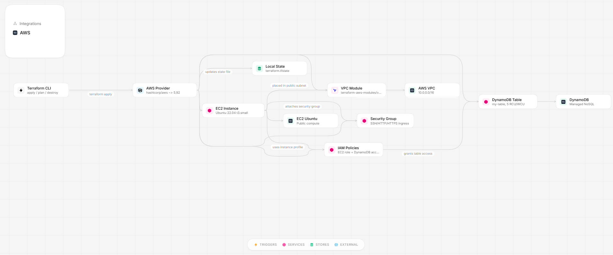

ec2-dynamodb-infra-stack
========================

### Architecture diagram

Purpose
-------
This Terraform workspace provisions a simple learning stack on AWS that demonstrates a VPC, public/private subnets, an EC2 instance with an IAM instance profile, and a DynamoDB table. It is intentionally minimal for education and experimentation.

What this configuration builds (exact files)
-------------------------------------------
- VPC and subnets: module "vpc" (network.tf)
  - Creates a VPC (CIDR 10.0.0.0/16) with two AZs, two public and two private subnets.
- Security group: aws_security_group.example_sg (security.tf)
  - example-sg with ingress rules for SSH (22), HTTP (80), HTTPS (443) and an all-outbound egress rule.
  - NOTE: SSH is currently open to 0.0.0.0/0 in the example — restrict to your IP before applying in real environments.
- EC2 instance: aws_instance.web_server (main.tf)
  - Ubuntu AMI selected via data.aws_ami (Ubuntu 22.04), default instance_type t4g.small.
  - Uses key_name "learn-terraform-key" (must exist in your AWS account) and attaches to example_sg and a public subnet.
  - Attaches IAM instance profile aws_iam_instance_profile.app_profile so the instance can assume the provisioned role.
- IAM role & policy: aws_iam_role.app_role, aws_iam_policy.dynamodb_access, aws_iam_instance_profile.app_profile (policy.tf)
  - Role allows EC2 to assume it; policy grants DynamoDB CRUD access scoped to the created table.
- DynamoDB table: aws_dynamodb_table.my_table (database.tf)
  - Table name: my-table, billing_mode PROVISIONED, numeric hash key "id", read_capacity/write_capacity = 5.
- Outputs (outputs.tf)
  - instance_hostname, security_group_id, dynamodb_table_arn/name, vpc_id
- Terraform settings: terraform.tf (required provider aws ~> 5.92, Terraform >= 1.2)
- Backend: backend.tf (local backend: tmp/terraform.tfstate). For teams, migrate to remote backend with locking.

### Resource Summary

| Component | Resource | Details |
|-----------|----------|---------|
| Compute | `aws_instance.web_server` | Ubuntu 22.04, t3.small, public IP |
| Network | `module.vpc` | 2 public + 2 private subnets across 2 AZs |
| Security | `aws_security_group.example_sg` | SSH (22), HTTP (80), HTTPS (443) |
| AMI | `data.aws_ami.ubuntu` | Latest Ubuntu 22.04 amd64 |
| Variables | `instance_name`, `instance_type` | Parameterized config |
| Outputs | `instance_hostname` | Private DNS of EC2 instance |

Prerequisites
-------------
- Terraform >= 1.2 installed
- AWS CLI configured with credentials (or environment variables)
- IAM permissions to create: VPC, EC2, IAM roles/profiles, DynamoDB, Security Groups
- Create or import an EC2 key pair named "learn-terraform-key" in the target AWS region

Create a key pair (example)
---------------------------
aws ec2 create-key-pair --key-name learn-terraform-key --query 'KeyMaterial' --output text > learn-terraform-key.pem
chmod 600 learn-terraform-key.pem

Set the region (if not af-south-1):
export AWS_REGION=af-south-1

Recommended workflow
--------------------
1. Initialize:
   terraform init

2. (Optional) Review variables or create terraform.tfvars.

3. Validate:
   terraform validate

4. Plan:
   terraform plan -out plan.tfplan

5. Apply:
   terraform apply "plan.tfplan"

6. Inspect outputs:
   terraform output

7. Tear down when done to avoid charges:
   terraform destroy

Variables
---------
- instance_name (variable.tf) — default "learn-terraform"
- instance_type — default "t4g.small"
- ami_id — default provided; the config uses a data.aws_ami lookup for Ubuntu 22.04

Security & operational notes
----------------------------
- Restrict SSH (22) to a specific IP (CIDR /32) before applying in production.
- Do not commit .terraform/ or provider binaries. .gitignore should include ".terraform/".
- Use a remote backend (S3 + DynamoDB) for team/state locking in non-exercise environments.
- The IAM policy included grants DynamoDB access to the created table only; review and tighten as needed.

Troubleshooting
---------------
- Provider download issues: run terraform init -upgrade and ensure network connectivity.
- If Git rejects pushes due to large files, ensure .terraform/ and provider binaries are not tracked and remove them from history.

Contact / Next steps
--------------------
- To harden: limit SSH, enable private-only subnets for workloads, and move state to a remote backend.
- To extend: add user-data provisioning, CloudWatch logs, or an application artifact deployment.

